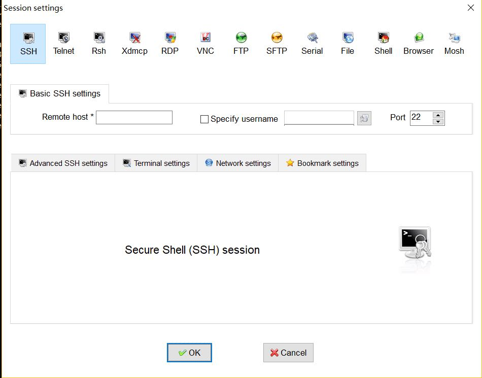

# 远程连接到服务器

HPC服务器只能在校园网登录, 集群ip是`219.217.238.193`.  

要连接到服务器，用户需要有已经在服务器创建好的账户和其对应密码  
如还未创建账户，请联系系统管理员。
  
以下假定用户`abc`使用密码`passwd`连接到服务器，介绍基本登录指令和使用`ssh-copy-id`的免密码登录方法  
默认登录后的目录在`/home/abc`, 这一目录也是`abc`用户的`~`目录


## *nix 环境(Ubuntu, macOS, centos)
在终端中输入`ssh abc@219.217.238.193`  
出现输入密码的提示后，输入相应密码即可  

为了省去每次输入IP地址的步骤，可以将ssh命令写入到脚本login.sh：
```
#!/bin/sh                                                                      
ssh yourName@219.217.238.193
```
然后运行
```
chmod +x login.sh
./login.sh
```
即可建立连接，等待输入密码。


## Windows 环境
Windows下需要使用连接工具进行连接。    
可以选择的连接工具包括[MobaXterm](https://mobaxterm.mobatek.net/)、[PuTTY](http://www.putty.org/)等  
其中MobaXterm支持文件拖拽上传。

使用MobaXterm 建立一个session来保存连接信息。



不同的连接工具连接方式可能略有不同，但一般情况下配置好服务器IP和用户，进行连接，输入密码即可。


## 免密码登录
默认情况下，SSH每次连接都需要密码。通过以下步骤可以省去这一步骤。
(部分Windows 环境下的连接工具可能不支持这里的命令，欢迎大家尝试和反馈各工具的使用体验来帮助我们推荐更好的工具）

-1. 执行`ssh-keygen -t rsa`   
将会输出：
```
Generating public/private rsa key pair.
Enter file in which to save the key (/home/abc/.ssh/id_rsa): 　[输入想要保存的文件名，否则使用默认文件名。]
Enter passphrase (empty for no passphrase): 　　[输入你之前提交的远程主机登录密码]
Enter same passphrase again: 　　[再次输入上一密码]
Your identification has been saved in /home/abc/.ssh/id_rsa.
Your public key has been saved in /home/abc/.ssh/id_rsa.pub.  (根据之前输入的文件名,实际文件会有不同)
The key fingerprint is:
e1:dc:ab:ae:b6:19:b0:19:74:d5:fe:57:3f:32:b4:d0 matrix@vivid
The key's randomart image is:
+---[RSA 4096]----+
| .. |
| . . |
| . . .. . |
| . . o o.. E .|
| o S ..o ...|
| = ..+...|
| o . . .o .|
| .o . |
| .++o |
+-----------------+
```

-2. 继续执行`ssh-copy-id abc@219.217.238.193`   
这一步骤将SSH公钥保存到服务器。


## 账号与密码
账号申请、密码找回等，请联系管理员操作。

# 传送文件

### *nix环境

使用scp命令，见[Linux使用-基础命令](linuxBasic/commands#数据传输)部分  
建议先将文件夹/大文件压缩，然后再传输。

### Windows环境
可以选择的工具有SecureFx等。
与远程登录类似，您需要配置好您的用户名和密码。


