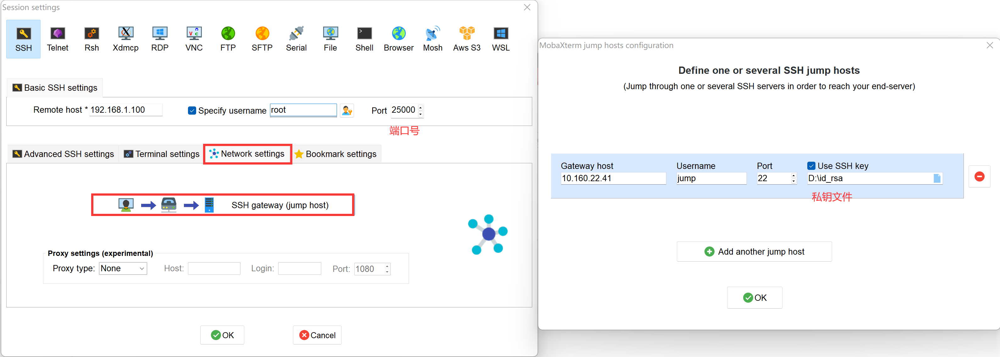

# 远程连接到服务器

HPC服务器可以在校园网环境登录, 在校外可以使用[哈工大vpn](https://ivpn.hit.edu.cn/)进入内网环境。集群地址是[https://server.iil.ac.cn/index.html](https://server.iil.ac.cn/index.html)，或者`https://10.160.22.41.index.html`。目前的SSL证书不安全，不影响使用。

要连接到服务器，用户需要有已经在服务器创建好的账户和其对应密码
如还未创建账户，请联系系统管理员。

用户无法直接通过ssh连接到集群，但是可以在集群管理页面创建交互式开发环境，并通过ssh连接到该环境。目前服务器只开放22端口，因此连接到交互式开发环境需要使用master做跳板机，但是严禁使用ssh隧道 。跳板机的连接需通过RSA密钥，请联系管理员将公钥上传到master跳板机。

以下假定用户`root`使用密钥连接到交互式开发环境，且系统分配端口为25000
默认登录后的目录在`/root`，需要注意的是，因所在计算节点重启等问题，导致交互式环境发生重置后，除`/opt/data`目录外，其余目录均会被清空。

## *nix 环境(Ubuntu, macOS, centos)
在终端中输入`ssh jump@10.160.22.41`，登陆跳板机；
接着在终端输入`ssh -p 25001 root@192.168.1.100`，出现输入密码的提示后，输入`passwd`。

## Windows 环境
Windows下需要使用连接工具进行连接。
推荐的连接工具为[MobaXterm](https://mobaxterm.mobatek.net/).

使用MobaXterm 建立一个session来保存连接信息。

## 账号与密码
账号申请、重置密码等，请联系管理员操作。

# 传送文件
可使用MobaXterm的文件传输功能传送文件。